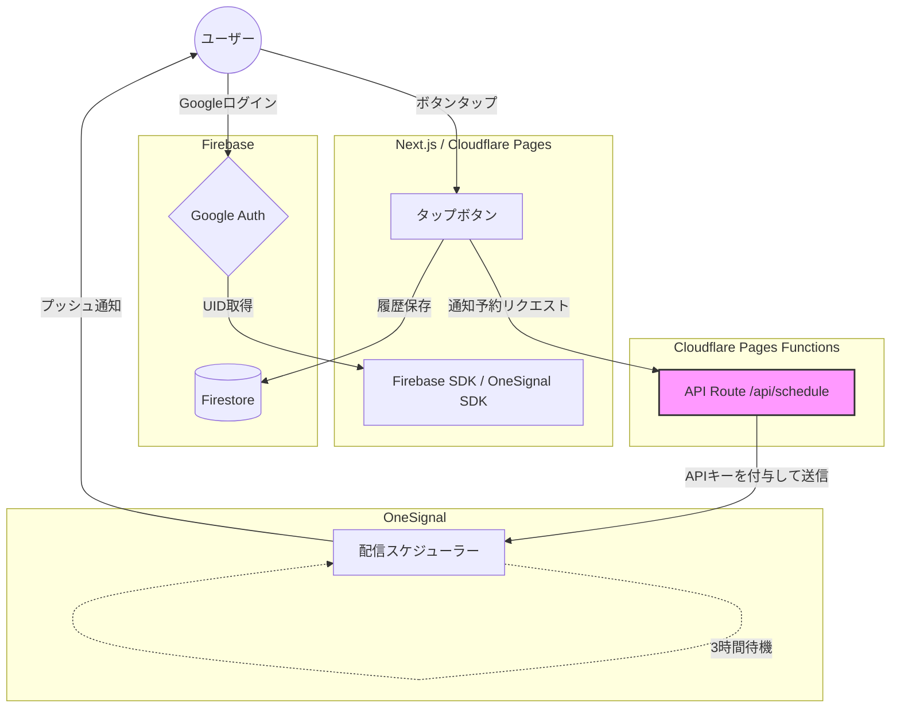

# Cafe Timer (hw-ba-cafe)

Next.js 16 で構築された、Cloudflare Pages 上で動作するカフェタイマー PWA です。

## 技術スタック

* **Framework:** Next.js 16 (App Router)
* **Deployment:** Cloudflare Pages
* **Build Tool:** @cloudflare/next-on-pages
* **Push Notification:** OneSignal
* **Styling:** Tailwind CSS

## セットアップ & 開発

### 1. 依存関係のインストール
```
bun i
```

### 2. 開発サーバーの起動
```
bun dev
```

### 3. Check
```
bun lint
```
and
```
bun pages:build
```

## ビルド & デプロイ
Cloudflare Pages でのビルドには特定の設定が必要です。

### Cloudflare Pages ビルド設定
- Build command: `npx @cloudflare/next-on-pages@1`
- Build output directory: `.vercel/output/static`
- Compatibility Date: `2024-12-30`
- Compatibility Flags: `nodejs_compat`

### 設定
1. output 設定の禁止: `next.config.ts`で`output: 'standalone'`や`output: 'export'`は設定しません。設定すると、Cloudflare 向けのビルドプロセスと競合し、404エラーの原因となります。

## プロジェクト構成案：Firebase × Cloudflare × OneSignal

### 1. システム概要

ユーザーがアプリ上のボタンをタップすると、その履歴を即座に保存し、正確に3時間後にプッシュ通知を送信する。複雑な遅延処理の管理を自前で持たず、外部サービスのスケジュール機能にオフロードすることで、サーバーレスかつ低コストで堅牢な仕組みを実現する。

### 2. 技術選定と役割

| コンポーネント | 選定ツール | 担当機能 |
| --- | --- | --- |
| **Frontend** | Next.js (TypeScript) | UI、Google認証のトリガー、Firestoreへの書き込み、通知予約APIの呼び出し |
| **Authentication** | Firebase Auth | Googleログインによるユーザー識別とセッション管理 |
| **Database** | Firebase Firestore | ユーザーごとのタップ履歴保存、セキュリティルールによる権限管理 |
| **Edge Functions** | Cloudflare Pages Functions | OneSignal APIキーの秘匿、通知予約リクエストのプロキシ |
| **Push Engine** | OneSignal | `send_after` パラメータによる3時間後の通知スケジューリング、通知配信 |

### 3. データフロー

1. **Auth**: ユーザーがGoogleアカウントでサインイン。Firebase UIDを取得。
2. **Save**: ボタンタップ時、FrontendからFirestoreの `/users/{uid}/taps` へレコードを書き込み。
3. **Request**: Frontendから Cloudflare Pages Functions (`/api/schedule`) へ `uid` を送信。
4. **Schedule**: FunctionsがOneSignal APIを叩き、「3時間後」の時刻を指定して通知を予約。
5. **Delivery**: 3時間経過後、OneSignalが自動的にターゲット（`external_id == uid`）へ通知を配信。

#### 4. 実装上の重要ポイント

* **APIキーの保護**: OneSignalの `REST API Key` はブラウザ側に露出させず、必ずCloudflareの環境変数として管理し、Functions経由でのみ使用する。
* **IDの紐付け**: OneSignalのSDKを使用して、Firebaseの `uid` をOneSignalの `external_user_id` としてセットしておく。これにより、APIから特定のユーザーを簡単に指定できる。
* **冪等性の考慮**: 連打による通知の重複を防ぐ場合、FirestoreのドキュメントIDやOneSignalの `idempotency_key` の活用を検討する。



